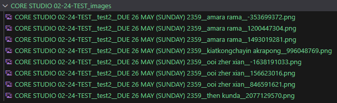
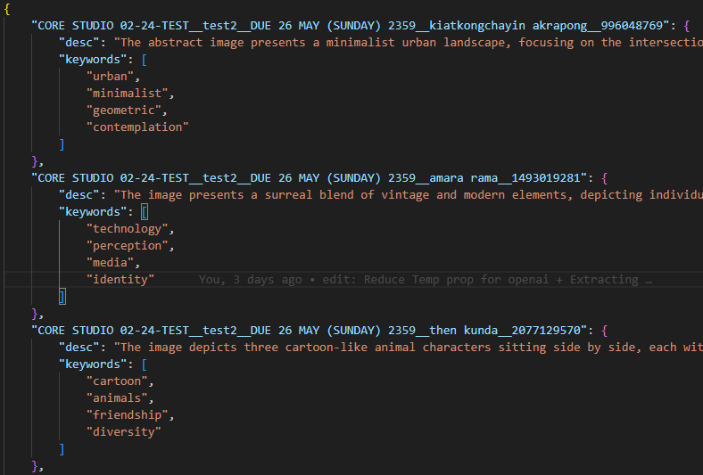

# TextAI

## End Goal
- Generate related keywords and summaries/descriptions from images and the provided context.
- Gain deeper insights on abstract images made by students
- If an image contains only text, the returned description should be exactly that text.
- Summaries should have a minimum of 40 words.
- Include up to 4 keywords.
- Returns a JSON output file

## Introduction
This tool processes images submitted from a popular website (TLDRAW) and generates related texts or summaries. It works alongside the [tlextractor](https://github.com/LamJingJie/tlextractor) repo. Each image saved from that repo corresponds to a key in the project’s JSON output (see the file "output_example.json"). It requires the data to be in a certain template (see next section).

- Text-based images → description is the exact text  
- Summaries → minimum of 40 words  
- Keywords → up to 4 allowed  
- Built only with tldraw website in mind

Use your own OpenAI API key by renaming “.env.example” to “.env” and pasting your key into that file.

### Example

| tlextractor                               | textAI JSON Output                         |
|------------------------------------------|--------------------------------------------|
|  |   |


### Templates
- [Standard Template](https://github.com/LamJingJie/tlextractor)  
- [Custom Template](https://github.com/LamJingJie/tldraw/tree/dynamic_submission_template)

## Important Notes
- A low temperature (0.1) ensures reproducible image descriptions and keywords. A higher temperature may cause “hallucinations” or overly creative results.  
- Images are sent at “high” quality (detail=high). This requires a <b>768×2048 (or 2048×768)</b> resolution.  
- The cost scales with resolution (e.g., every 512px boundary costs 170 tokens + an additional 85 tokens to the final tokens).  
- Using the model <b>gpt-4o-2024-08-06</b> for vision, cannot use O1 without a higher-tier account (Tier 5).  
- The average cost is about <b>$0.01</b> per 3 images.  
- The model accepts files up to 20MB.  
- Currently using “Structured Outputs” from OpenAI, though min/max constraints on summaries and keywords are not fully supported yet (so it’s enforced via prompt).

## Software(s) used
- Python ver 3.12^
- Playwright
- Multi-Processing & Async Programming (for efficient processing and data transformation)
- openAI API for their vision model


## Setup Steps

1. Install the Virtual Environment
```bash
python install pipenv
```

2. Activate the Environment
```bash
pipenv shell
```

3. Install Dependencies
```bash
pipenv install
```

4. Install Playwright
```bash
playwright install
```

5. Run the Program
```bash
python main.py
```